# Lisakhanya Mpahla
### Software Engineer

**Location:** 14 Ravencraig House, Cape Town

**Phone:** 0633292143

**Email:** 230126669@mycput.ac.za

**GitHub:** [github.com/Khanya03](https://github.com/Khanya03)

**LinkedIn:** [linkedin.com/in/lisakhanyampahla-69b8ab271](https://linkedin.com/in/lisakhanyampahla-69b8ab271)

---

## Profile

ICT - Software Development student with hands-on experience developing Java and Laravel-based client-server applications using object-oriented programming and relational databases. Strong foundation in data structures, algorithms, software testing, and multi-tier system design through academic and internship experience. Fast learner with strong problem-solving skills, collaborative mindset, and interest in scalable, data-driven systems. Seeking a Software Engineering Intern or Graduate role to gain industry experience and contribute to real-world software solutions.

---

## Education

**Diploma in ICT (Software Development)**
*Cape Peninsula University of Technology, Cape Town*
2023 – 2026

**High School**
*Ezingcuka High School, Butterworth*

---

## Certifications & Professional Development

- **AWS Certified Developer – Associate (DVA-C02) Cert Prep**
  *Completed Mar 24, 2026*

- **Spring Boot 3 Essential Training**
  *Completed Mar 24, 2026*

- **Learning Java 11**
  *Completed Mar 23, 2026*

---

## Skills

| Category | Technologies & Tools |
|----------|----------------------|
| **Languages** | Java, PHP, JavaScript, HTML, CSS, SQL (queries, joins, constraints) |
| **Frameworks & Libraries** | Laravel, Vaadin, Spring Boot |
| **Tools & Platforms** | Git, GitHub, Maven, XAMPP, Visual Studio Code |
| **Databases** | MySQL |
| **Core Concepts** | Object-Oriented Programming, Software Testing, Multi-Tier System Design |
| **Cloud & DevOps** | Amazon Web Services (AWS), Cloud Application Development |

---

## Employment

### Backend Development Intern
**Plum Systems / Co-Parent, Cape Town**

- Assisted with backend development using PHP and MySQL (OOP)
- Worked with existing codebases using Git version control
- Gained exposure to production-level systems and multi-tier architectures

### Software Testing Intern
**Plum Systems / Co-Parent, Cape Town**

- Performed manual software testing on backend systems
- Executed test cases and documented defects clearly for developers
- Collaborated with developers and team leads in an Agile environment

---

## Projects

### Trailer Hire Management System
*Java | MySQL | Spring Boot*

- Built using Domain-Driven Design (DDD) and Spring Boot to model customers, trailers, and bookings as distinct domains
- Applied Test-Driven Development (TDD) to ensure reliability of business logic and rental rules
- Designed MySQL database with constraints and relationships for data integrity
- Developed frontend using Laravel Blade templates with responsive UI

**Link:** [github.com/Samnke/Trailer-Hire-Project](https://github.com/Samnke/Trailer-Hire-Project)

**Screenshots:**

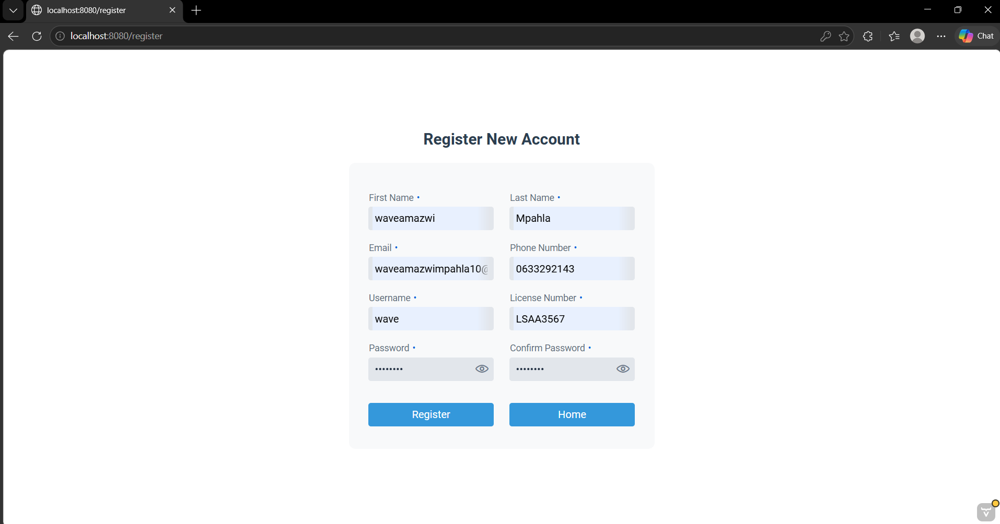
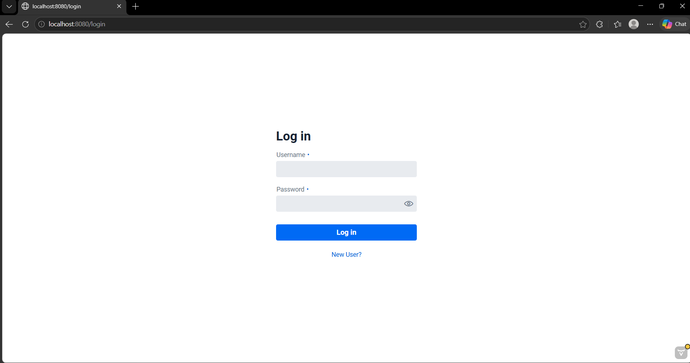
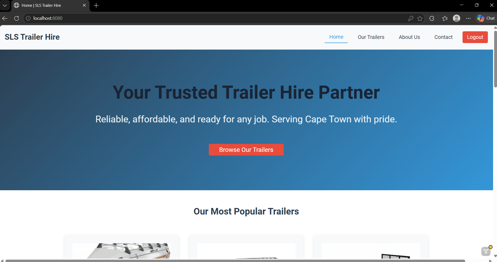
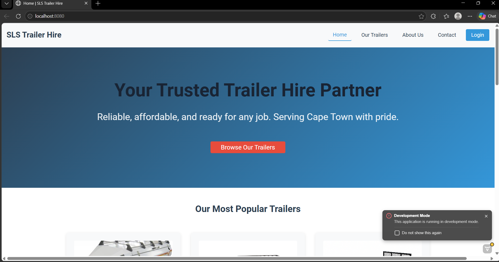
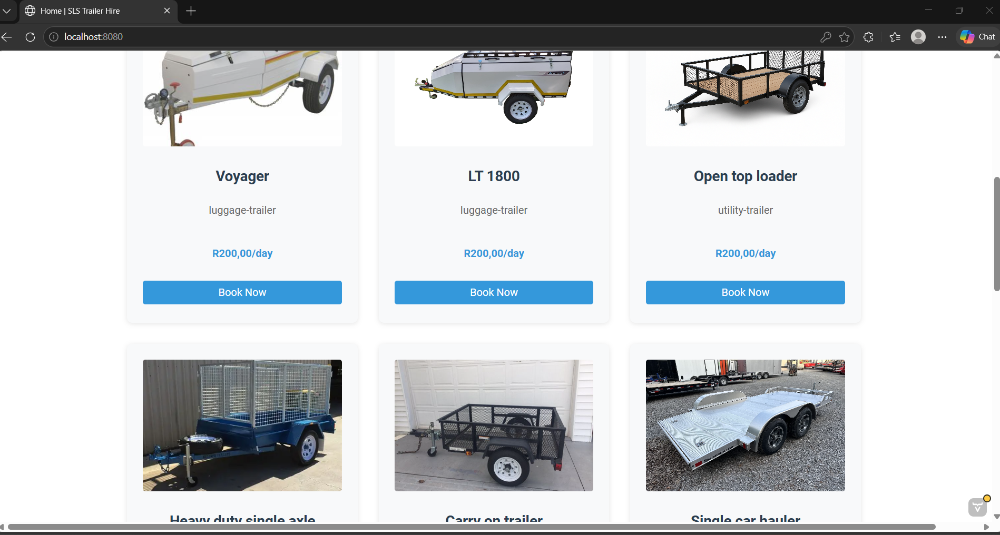
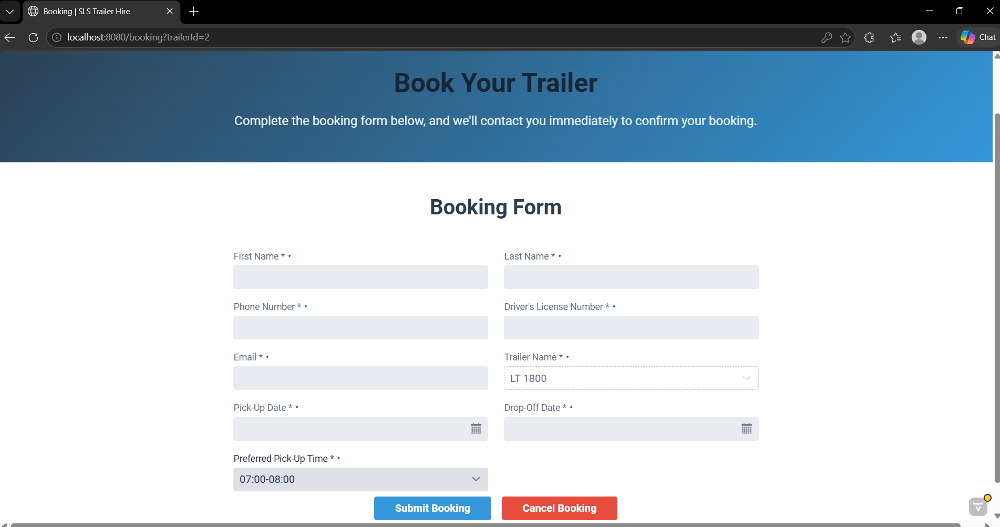
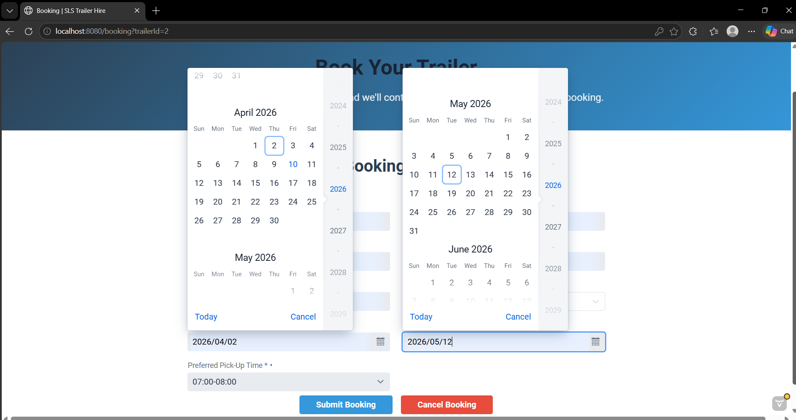
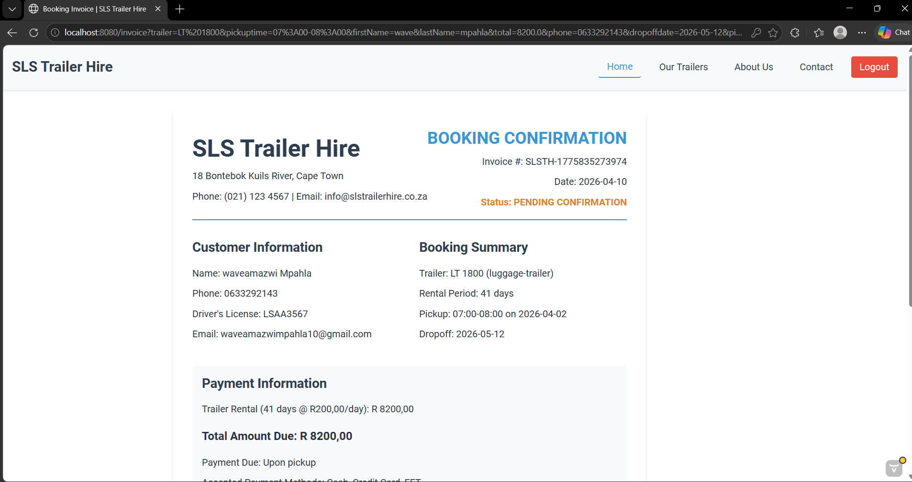
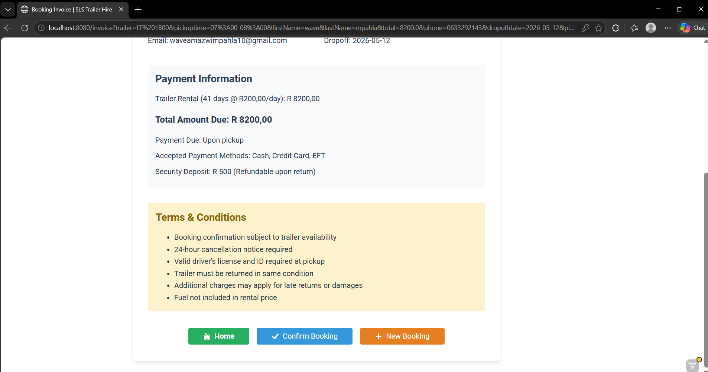

---

### Student-Tutor Matching Platform
*Laravel | JavaScript | MySQL*

- Developed a multi-tier web application to connect students with tutors and lecturers
- Designed and executed SQL queries for user management and data retrieval
- Built dynamic frontend components using JavaScript

**Link:** [github.com/SeanJBailey/Project3](https://github.com/SeanJBailey/Project3)

**Screenshots:**

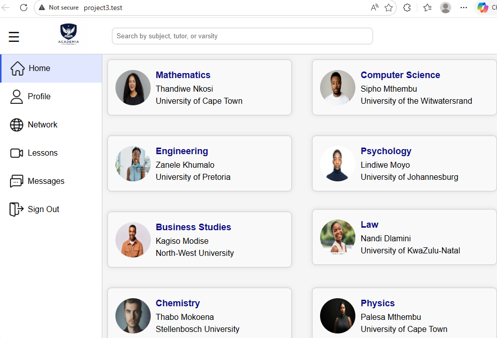
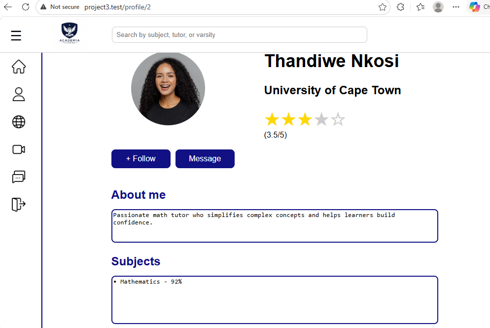
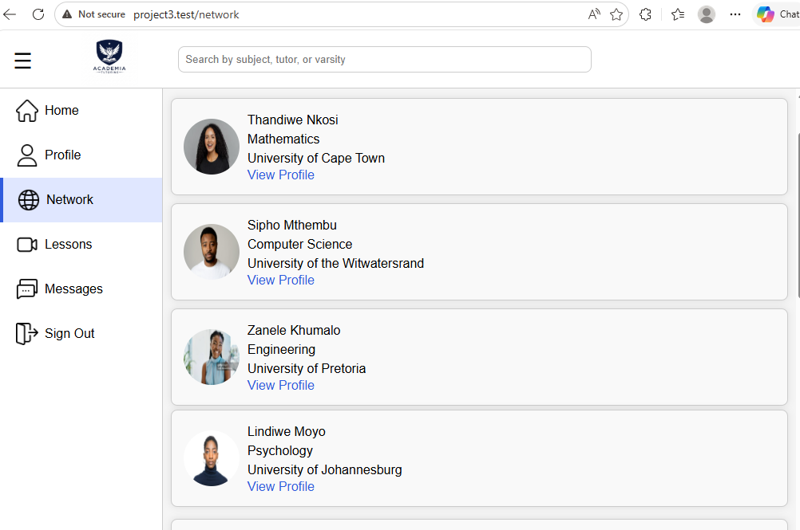
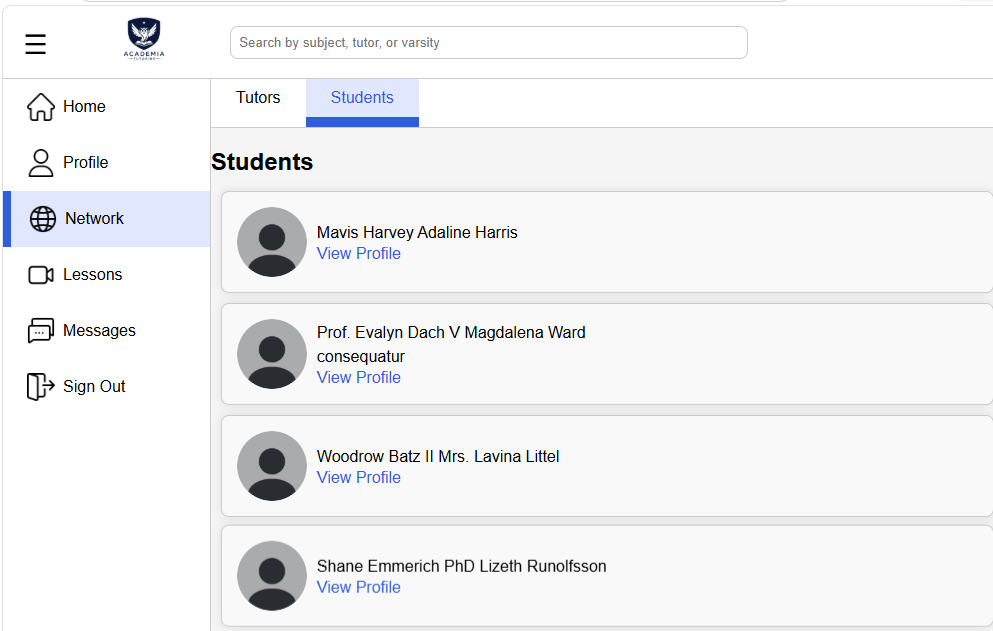
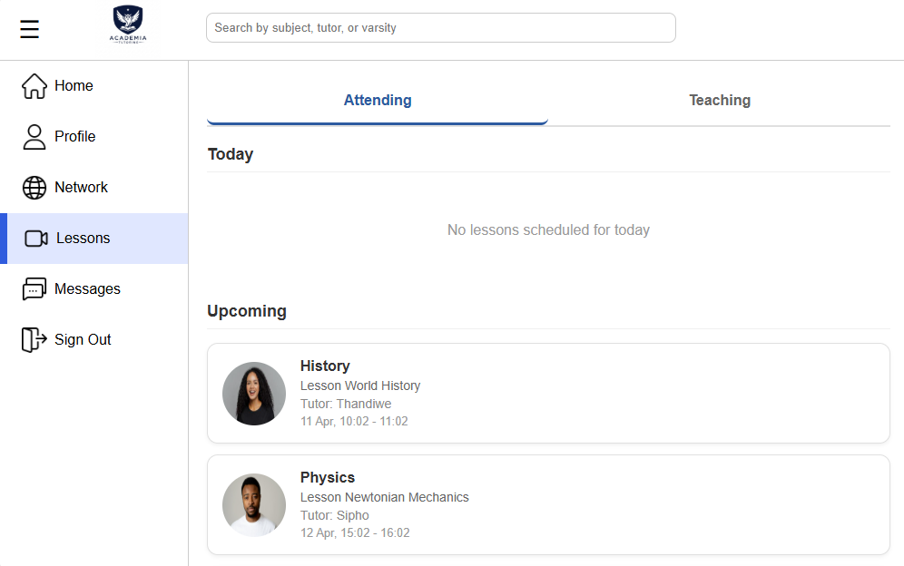
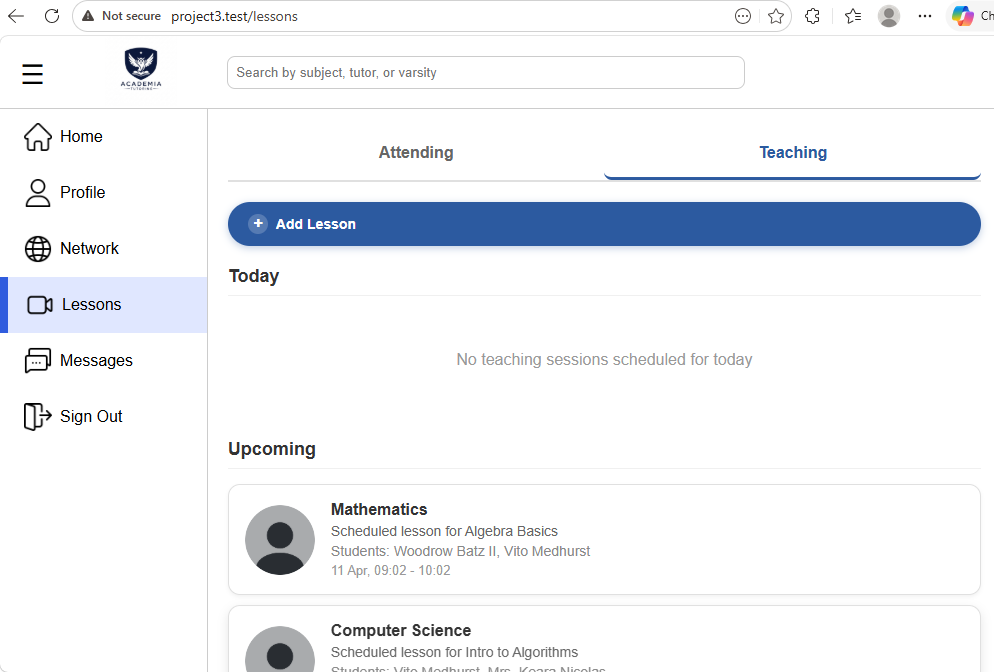
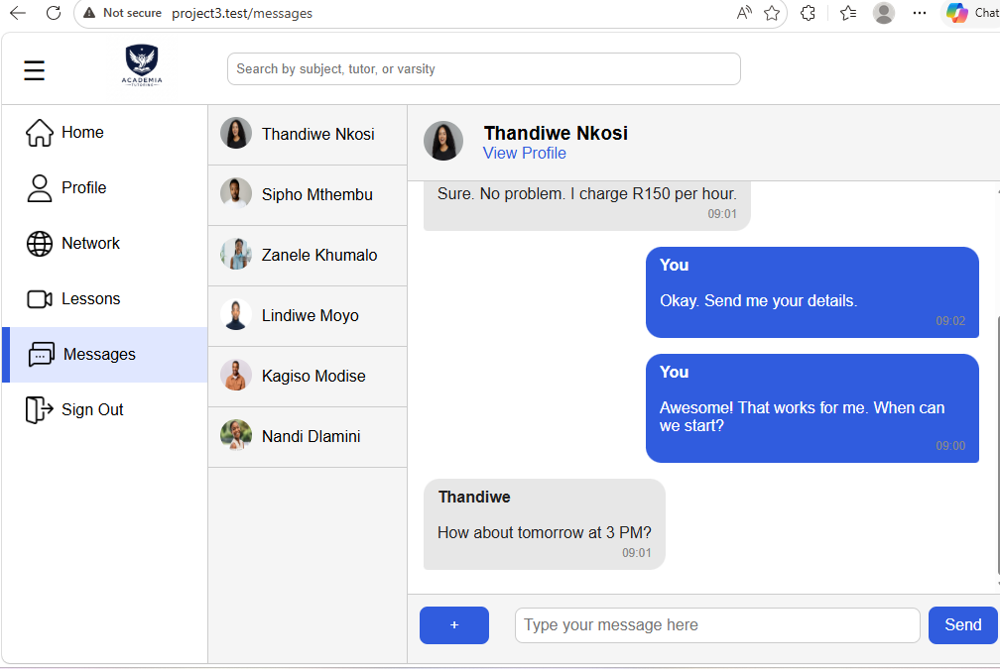
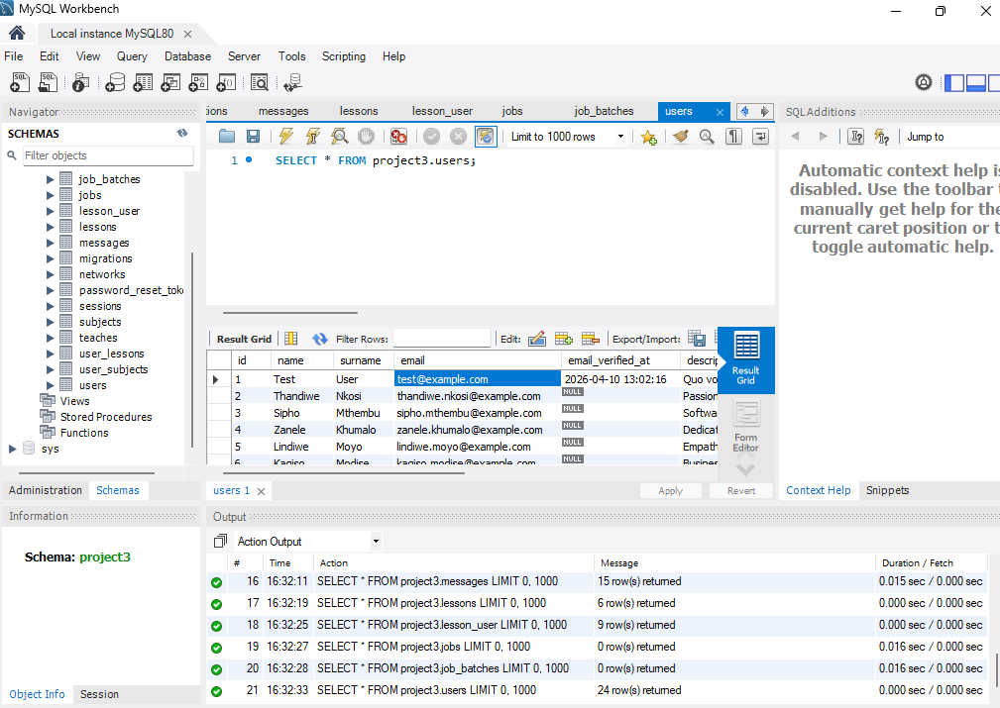

---

### Personal Portfolio Website
*HTML | CSS | GitHub Pages | Markdown*

- Designed and developed a personal portfolio website to showcase academic and professional work
- Coded entirely in Markdown and deployed using GitHub Pages
- Structured content to include a CV, project showcase, and mock interview video
- Applied GitHub Flavoured Markdown (GFM) features including tables, links, and embedded media

**Link:** [Khanya03.github.io](https://Khanya03.github.io)

---

## Reflections

### Reflection on Coding in Markdown – STAR Method

**Situation:**
As part of the Project Presentation 3 module at CPUT, I was required to build a digital portfolio using GitHub and present my work readiness through a structured e-portfolio. I had limited prior experience with Markdown and had mostly worked with HTML and CSS for web content.

**Task:**
My task was to code my entire CV and portfolio content using GitHub Flavoured Markdown (GFM), ensuring it was well-structured, readable, and professional enough to serve as evidence of my learning and development throughout the diploma.

**Action:**
I researched GitHub Flavoured Markdown documentation and practised using headings, tables, bullet points, bold/italic text, and image embedding. I structured my CV with clearly defined sections — Profile, Education, Skills, Employment, and Projects. I used tables for the skills section to improve readability and embedded project screenshots using Markdown image syntax. I also referenced the GitHub Education resources available to CPUT students to make use of the free developer tools.

**Result:**
I successfully produced a complete, professionally formatted CV coded entirely in Markdown and deployed on GitHub Pages. Through this process I gained a solid understanding of Markdown syntax and how it is used in real developer workflows — particularly in README files, issues, and pull requests. This skill is directly applicable to my future career in software engineering where clear documentation is essential.

---

### Reflection on Mock Interview Video Experience – STAR Method

**Situation:**
As part of my work readiness preparation, I was required to record a mock interview video to simulate a real job interview scenario. I had never formally recorded myself in a professional interview context before and felt nervous about presenting myself on camera.

**Task:**
My task was to prepare for and record a mock interview video that demonstrated my ability to communicate professionally, answer behavioural interview questions clearly, and present myself confidently as a software engineering candidate.

**Action:**
I prepared by researching common interview questions for software engineering roles, particularly around teamwork, problem-solving, and technical experience. I practised answering questions using the STAR method to structure my responses. I rehearsed multiple times before recording to improve my confidence and reduce filler words. I set up a clean, quiet environment for filming and dressed professionally. After recording, I reviewed the footage and identified areas for improvement such as eye contact and pacing.

**Result:**
I produced a mock interview video that showcased my communication skills and professional presentation. Watching myself back was a valuable learning experience — I identified weaknesses I was previously unaware of, such as speaking too quickly when nervous. This experience has better prepared me for real job interviews and helped me understand the importance of preparation and self-presentation in a professional environment.

---

### Reflection on the Use of GitHub Pages – STAR Method

**Situation:**
To complete the digital portfolio assessment, I needed to deploy my portfolio so it was publicly accessible online. While I had used GitHub for version control during my studies, I had not previously used GitHub Pages to host and publish a live website.

**Task:**
My task was to configure and deploy my GitHub repository as a live website using GitHub Pages, ensuring the portfolio was accessible via a public URL and that all content — including images and links — rendered correctly.

**Action:**
I navigated to my repository settings on GitHub and enabled GitHub Pages, selecting the main branch as the source. I tested the live URL to confirm the site was rendering correctly and debugged issues with image paths that were not displaying due to incorrect relative paths. I corrected the image links to use the full GitHub Pages URL format and committed the fixes. I also ensured the repository was set to public so it could be accessed by my lecturer and moderators.

**Result:**
My portfolio was successfully deployed and is live at [Khanya03.github.io](https://Khanya03.github.io). The experience taught me how to use GitHub Pages as a free hosting solution, which is a practical skill for any developer wanting to showcase their work. I now understand the full workflow of writing code, committing to a repository, and deploying it as a live site — a foundational DevOps concept I will continue to build on in my career.

---

<h2>Mock Interview Video</h2>
<video width="600" controls>
  <source src="assets/LisaVideoInteview.mp4" type="video/mp4">
  Your browser does not support the video tag.
</video>

[Watch my Mock Interview Video](https://Khanya03.github.io/assets/LisaVideoInteview.mp4)

---

## References

**Tashreeq**
Plum Systems, Cape Town
0768389012 | Tashreeq@plum.systems

**Tristan**
Plum Systems, Cape Town
0847399063 | tristan@plum.systems

